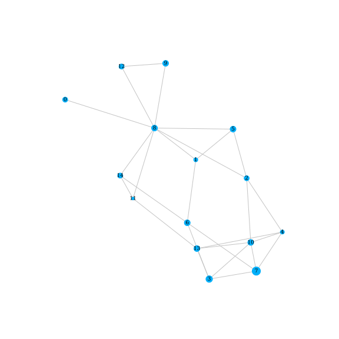
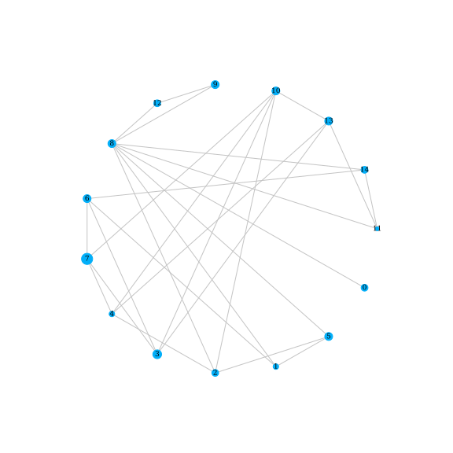
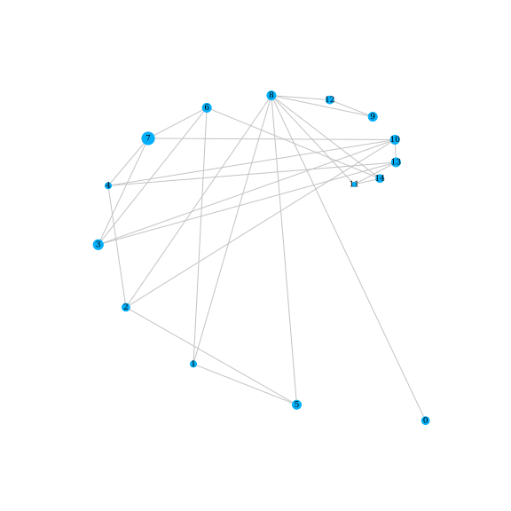
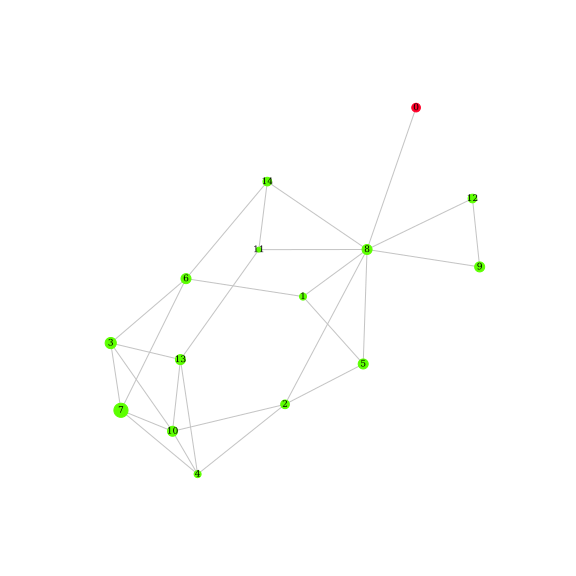
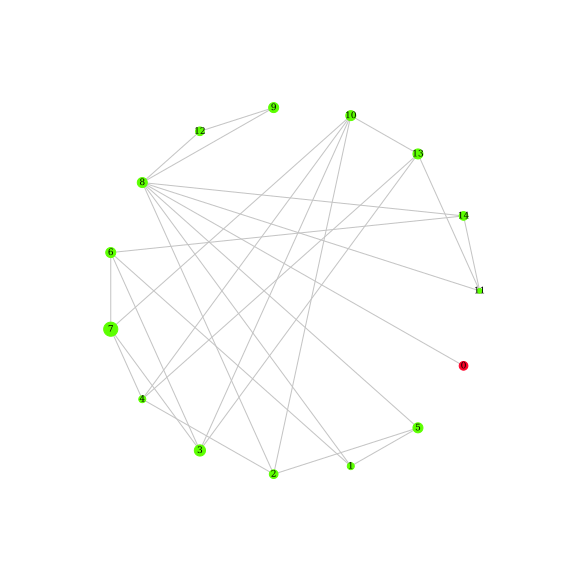
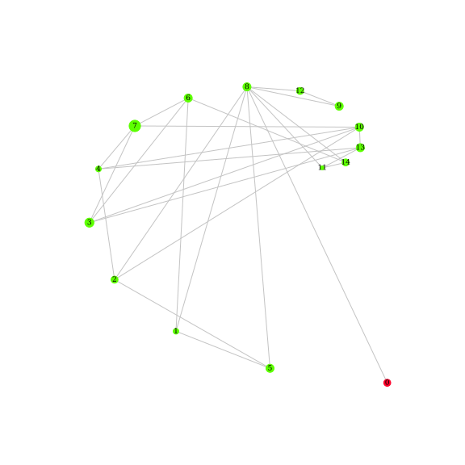
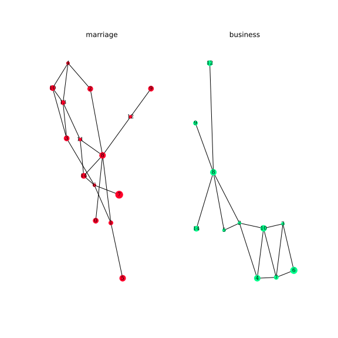
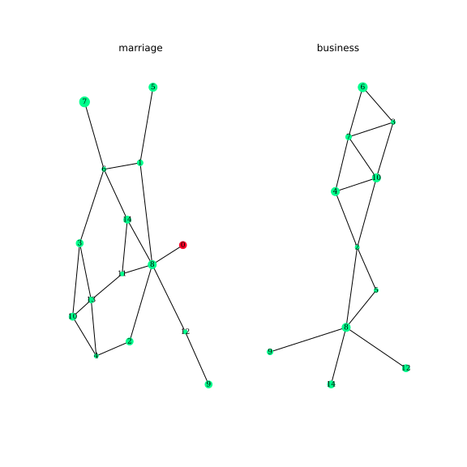
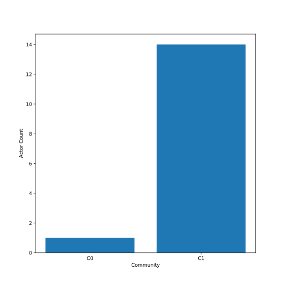
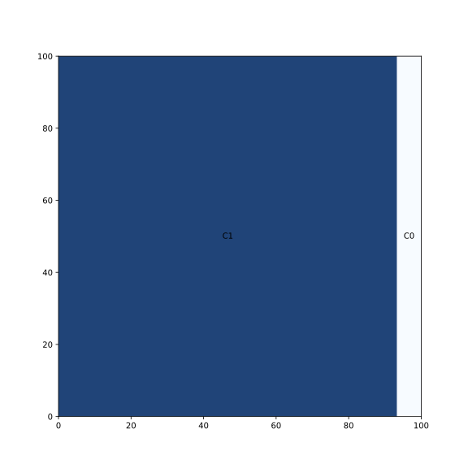

# MNCD - Visualization

This application exposed as a web api is used for different visualizations used in [MNCD application](https://github.com/matejkubinec/mncd-app) and can be also used for different purposes.

## Visualizations

The following charts are supported (ilustrated on the [Florentine dataset](networkdata.ics.uci.edu/netdata/html/florentine.html)):

| Charts                         |                                         |                                             |                                         |
| :----------------------------- | :-------------------------------------: | :-----------------------------------------: | :-------------------------------------: |
| **Single Layer - Network**     |                 Spring                  |                  Circular                   |                 Spiral                  |
|                                |      |      |      |
| **Single Layer - Communities** |                 Spring                  |                  Circular                   |                 Spiral                  |
|                                |  |  |  |
| **Multi Layer**                |                 Slices                  |                                             |                                         |
|                                |      |                                             |                                         |
| **Multi Layer - Communities**  |                 Slices                  |                                             |                                         |
|                                |  |                                             |                                         |
| **Common Charts**              |                 Barplot                 |                   Treemap                   |                                         |
|                                |    |        |                                         |

## Usage

You can run the application as docker container with the following command:

```sh
docker run --name mncd-viz -p 5050:5050 ghcr.io/matejkubinec/mncd-viz:edge
```

or alternatively with compose:

```yaml
services:
  mncd-viz:
    container_image: mncd-viz
    image: ghcr.io/matejkubinec/mncd-viz:edge
    restart: unless-stopped
    ports:
      - "5050:5050"
```

## Development

To setup the development environment use the following commands:

```sh
# 1. Create virtual environment
make venv

# 2. Install dependencies
make deps

# 3. Run the application
make run
```

## Building docker image

Run the following command to build the docker image:

```sh
make image
```

## License

Licensed under [MIT](./license.txt)
